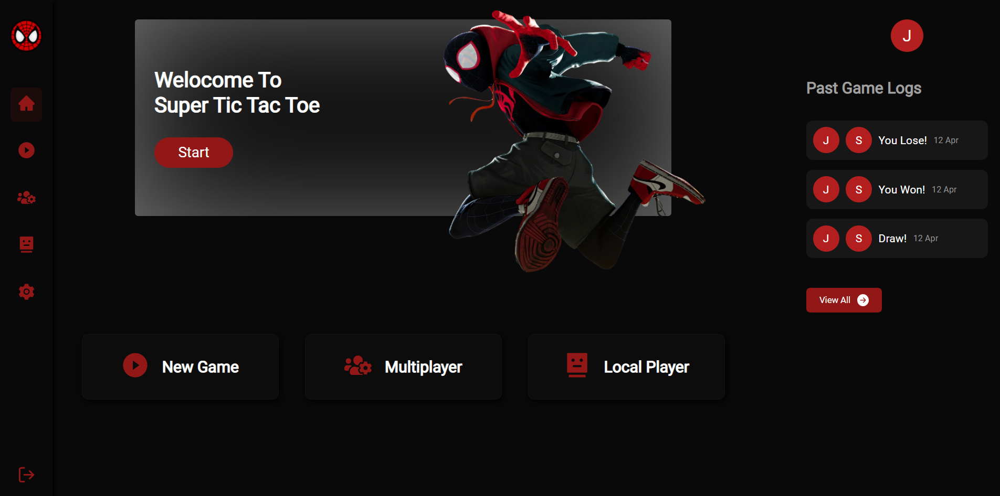
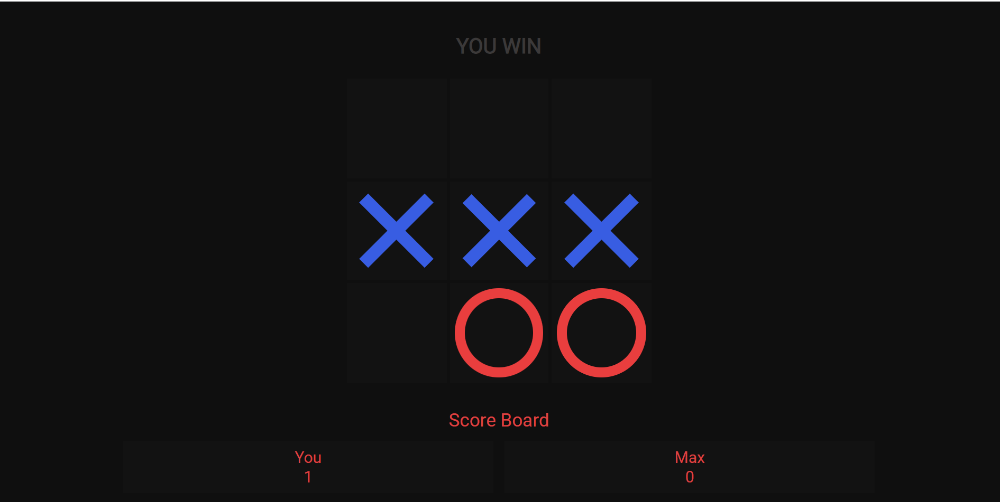
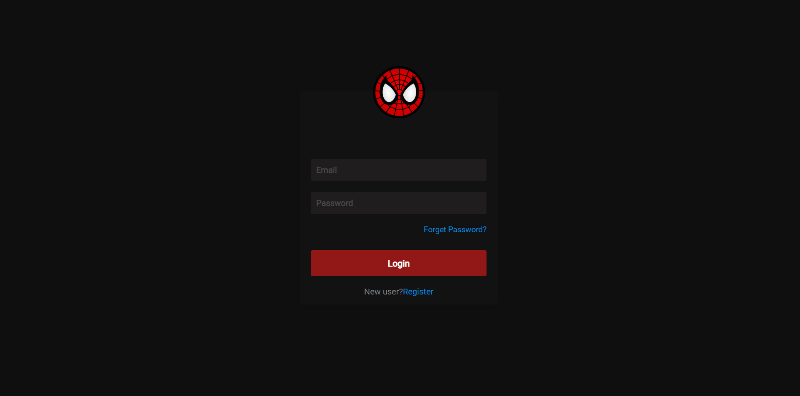

# SuperT3🚀⚡- Multiplayer Tic Tac Toe Game

  

 

> A multiplayer tic tac toe game made using MERN stack (UNDER DEVLOPEMENT)  
> Uses Web Sockets for real time communication 

## ⚙️ Detailed Functionality

- Users can authenticate themselves by Email if they want to save thier previous game logs
- There are three types of game in one app
- First is local player- where users can play with themeselevs
- Second is Multiplayer - where any user can pay with any another user where ever in world with that room id
- Second is Bot player - Where user can play with computer bot
- Result is declared after game is over.

## 🚀 Tech and Tools Used

- React.JS ,Redux ,NodeJS ,Socket.io,ExpressJs,MongoDB
- VS code,Heruko
- React Icons,REST APIS ,JWT ,

## 📸 Screenshots

## Home Page

 

## Multiplyaer Game Page

 

## Login Page

 

### LINK :

supert3.herokuapp.com/
